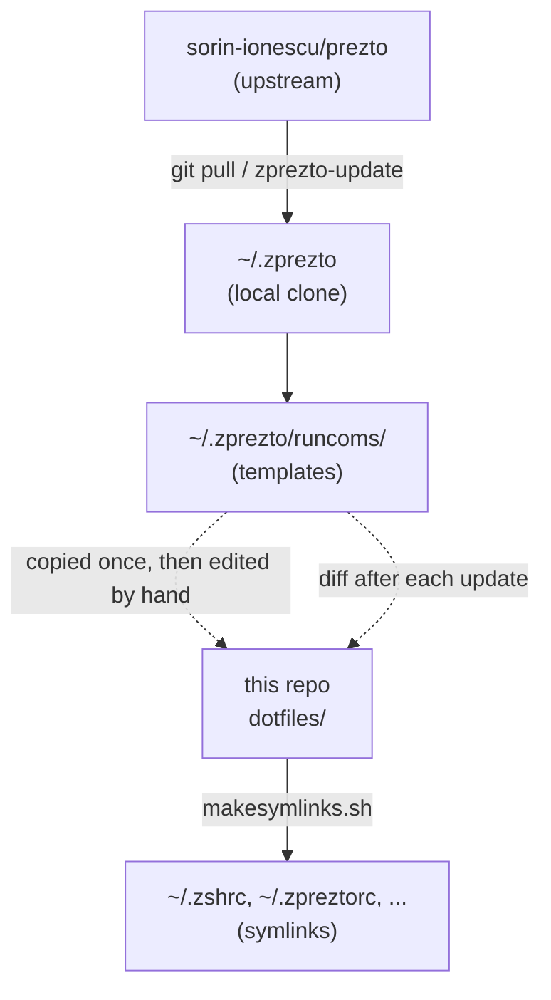

# dotfiles

## Overview



Solid arrows are automatic. Dashed arrows are manual - a Prezto update never touches the copies in this repo.

## Setup

```bash
chmod 755 makesymlinks.sh
./makesymlinks.sh
```

## Updating Prezto

```bash
zprezto-update
```

Prezto ships this function. It pulls the latest changes and syncs submodules, then points you at `$ZPREZTODIR` to resolve any conflicts yourself.

By hand:

```bash
cd $ZPREZTODIR
git pull
git submodule sync --recursive
git submodule update --init --recursive
```

The files in `dotfiles/` are forked from Prezto's templates in `runcoms/`. Prezto's own install symlinks those templates directly from its clone, so a pull updates them in place. This repo keeps edited copies, which a pull never touches. After updating, diff them and port across anything that changed:

```bash
for f in zshenv zprofile zshrc zpreztorc zlogin zlogout; do
  diff "${ZPREZTODIR:-$HOME/.zprezto}/runcoms/$f" "dotfiles/$f"
done
```

Then start a fresh login shell to check nothing broke:

```bash
zsh -li
```

## Files

### zshenv

Sourced by every instance of Zsh, so keep it small and limit it to environment variables.

### zprofile

Like _zlogin_, but sourced before _zshrc_. Added for KornShell fans. See _zlogin_ below for what it can hold.

The two aren't meant to be used together, though they can be.

### zshrc

Sourced by interactive shells. Aliases, functions, shell options, key bindings.

### zpreztorc

Configures Prezto.

### zlogin

Sourced by login shells after _zshrc_, for commands that need to run at login - messages such as `fortune` or `msgs`, or creating files.

Not the place for aliases, functions, shell options, or key bindings. It should not change the shell environment.

### zlogout

Sourced by login shells at logout, for displaying messages and deleting files.
